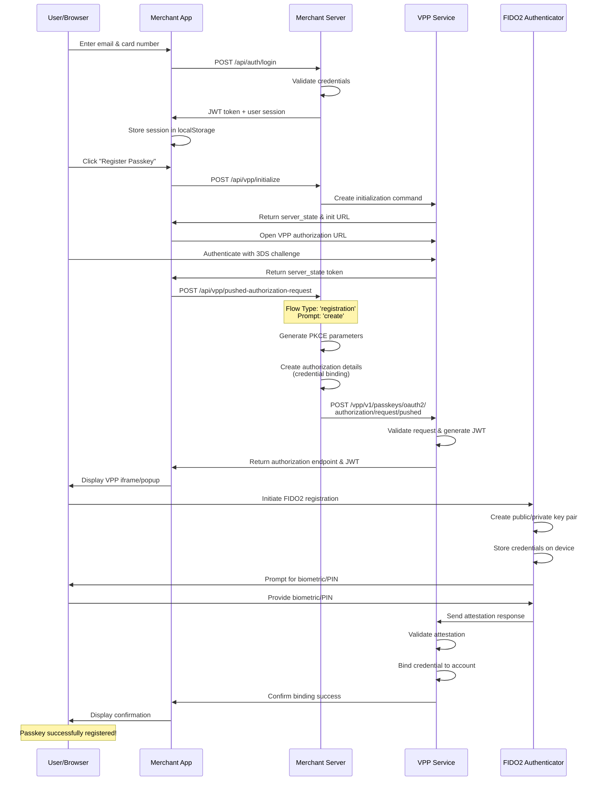
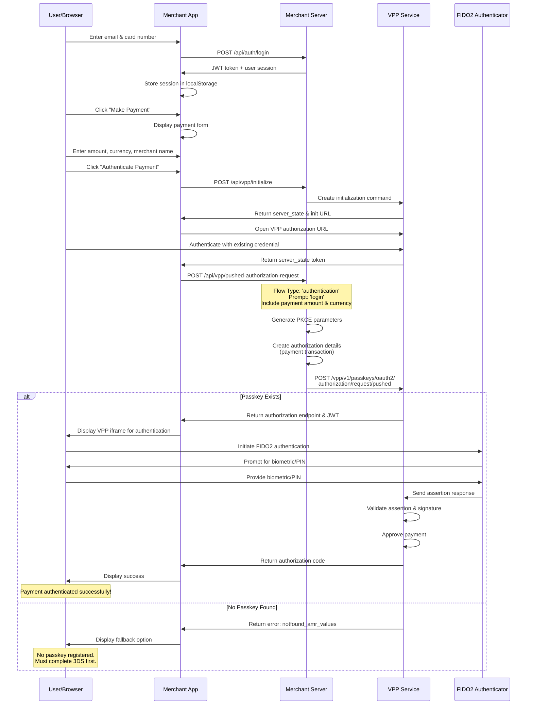
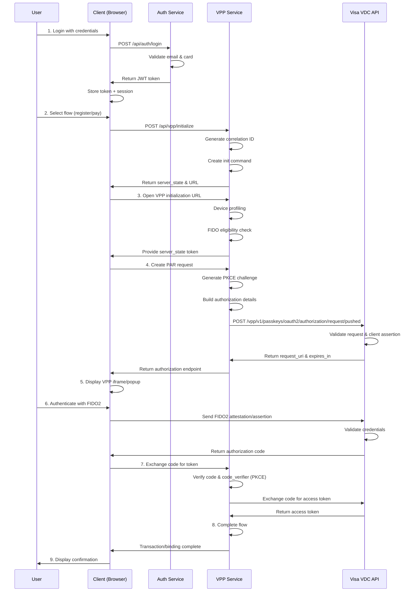
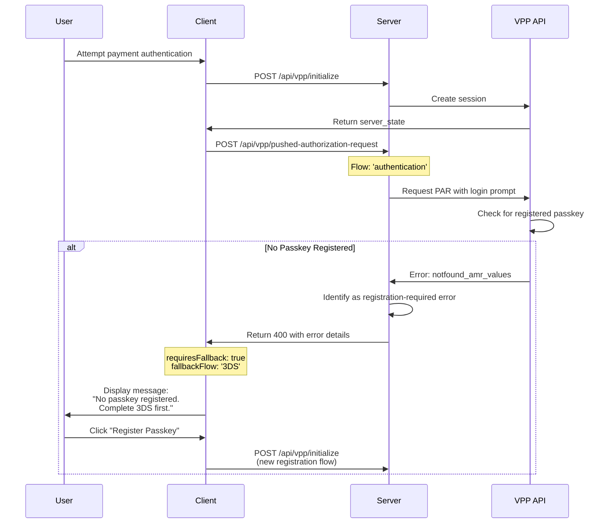
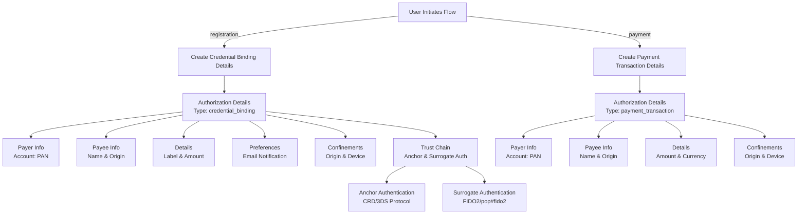
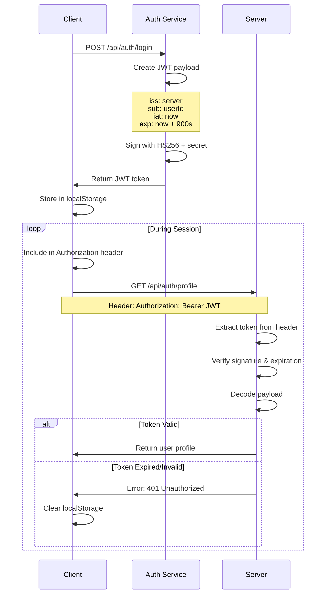

<!-- START GENAI -->
# VPP Merchant Implementation - Sequence Diagrams

## 1. Passkey Registration Flow

## 2. Payment Authentication Flow

## 3. Complete VPP Session Lifecycle

## 4. Error Handling Flow - No Passkey Scenario

## 5. Data Flow - Authorization Details Structure

## 6. JWT Token Lifecycle

<!-- END GENAI -->
