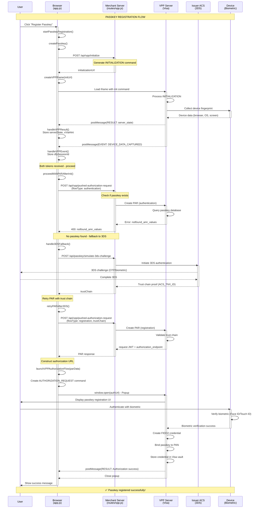
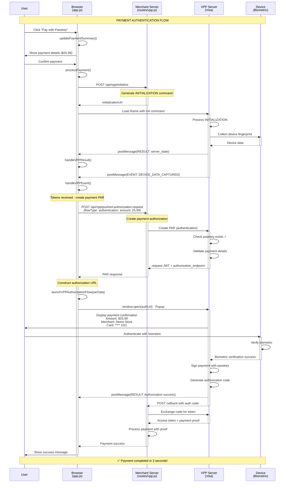

<!-- START GENAI -->
# Visa Payment Passkey (VPP) - Technical Solution Pitch

## Executive Summary

Visa Payment Passkey (VPP) is a revolutionary FIDO2-based authentication solution that replaces traditional payment authentication methods with biometric passkeys. This implementation demonstrates a complete merchant integration showcasing secure, frictionless payment experiences using device biometrics (Face ID, Touch ID, Windows Hello).

---

## 1. Introduction: The Problem & Solution

### The Challenge
- **Traditional Payment Authentication**: OTPs, passwords, and SMS codes create friction
- **Security Concerns**: Password-based systems are vulnerable to phishing and credential theft
- **User Experience**: Multiple authentication steps lead to cart abandonment
- **Compliance**: Meeting PSD2 SCA requirements while maintaining UX

### The VPP Solution
- **FIDO2-Based Authentication**: Leverages WebAuthn for cryptographic security
- **Biometric Convenience**: Face ID, Touch ID, or device PIN for seamless authentication
- **Enhanced Security**: Private keys never leave the device, eliminating phishing risks
- **Regulatory Compliance**: Meets SCA requirements with superior UX

### Business Value
- **Reduced Cart Abandonment**: Faster checkout = higher conversion rates
- **Lower Fraud**: Cryptographic authentication eliminates credential theft
- **Future-Proof**: Standards-based solution aligned with industry direction
- **Customer Satisfaction**: Seamless, secure payment experience

---

## 2. Architecture Overview

### High-Level Components

```
┌─────────────────────────────────────────────────────────────┐
│                     MERCHANT ECOSYSTEM                       │
├─────────────────────────────────────────────────────────────┤
│                                                               │
│  ┌──────────────┐         ┌──────────────┐                  │
│  │   Frontend   │◄───────►│   Backend    │                  │
│  │  (Browser)   │         │  (Node.js)   │                  │
│  └──────┬───────┘         └──────┬───────┘                  │
│         │                        │                           │
│         │ WebAuthn API           │ VPP APIs                  │
│         │                        │                           │
└─────────┼────────────────────────┼───────────────────────────┘
          │                        │
          │                        │
          ▼                        ▼
┌─────────────────────────────────────────────────────────────┐
│                    VISA INFRASTRUCTURE                       │
├─────────────────────────────────────────────────────────────┤
│                                                               │
│  ┌──────────────┐    ┌──────────────┐    ┌──────────────┐  │
│  │ VPP OAuth2   │    │   Device     │    │   Issuer     │  │
│  │   Server     │◄──►│  Profiling   │◄──►│     ACS      │  │
│  └──────────────┘    └──────────────┘    └──────────────┘  │
│                                                               │
└───────────────────────────────────────────────────────────────┘
          │                        │
          │                        │
          ▼                        ▼
┌─────────────────────────────────────────────────────────────┐
│                    USER'S DEVICE                             │
├─────────────────────────────────────────────────────────────┤
│  ┌──────────────┐    ┌──────────────┐                       │
│  │   Browser    │    │  Biometric   │                       │
│  │  WebAuthn    │◄──►│ Authenticator│                       │
│  └──────────────┘    └──────────────┘                       │
└───────────────────────────────────────────────────────────────┘
```

### Technology Stack

**Frontend:**
- Vanilla JavaScript (ES6+)
- WebAuthn API for FIDO2 operations
- PostMessage API for iframe communication
- Modern CSS with responsive design

**Backend:**
- Node.js with Express.js
- JWT for session management
- Axios for HTTP requests
- Crypto module for security operations

**Visa Integration:**
- VPP OAuth2 Authorization Server
- Device Profiling (VDI)
- Pushed Authorization Request (PAR)
- 3DS fallback integration

---

## 3. Demo Pitch Structure

### 3.1 Opening (2 minutes)
**Hook:** "Imagine completing a $100 payment with just your fingerprint - no passwords, no OTPs, no friction. That's Visa Payment Passkey."

**Key Points:**
- Traditional authentication creates 23% cart abandonment
- VPP reduces authentication time from 45 seconds to 3 seconds
- Built on FIDO2 standard - the future of authentication

### 3.2 Problem Statement (3 minutes)
**Current Pain Points:**
1. **For Customers:**
   - Remembering passwords for multiple merchants
   - Waiting for SMS OTPs that may not arrive
   - Complex 3DS flows that confuse users
   
2. **For Merchants:**
   - High cart abandonment rates
   - Fraud losses from credential theft
   - Customer support costs for password resets

3. **For Issuers:**
   - 3DS challenge rates impacting approval rates
   - Fraud detection complexity
   - Regulatory compliance overhead

### 3.3 Solution Overview (5 minutes)
**VPP Value Proposition:**

1. **Security Through Cryptography**
   - Private keys never leave the device
   - Phishing-resistant authentication
   - Device-bound credentials

2. **Seamless User Experience**
   - One-touch biometric authentication
   - No passwords to remember
   - Works across devices

3. **Regulatory Compliance**
   - Meets PSD2 SCA requirements
   - Strong Customer Authentication
   - Transaction risk analysis integration

### 3.4 Live Demo Walkthrough (15 minutes)

#### Part 1: User Registration Flow (7 minutes)

**Step 1: User Login**
```
Action: Navigate to demo site
Show: Clean, modern interface
Explain: "User logs in with email and card number - this is just for demo purposes"
```

**Step 2: Passkey Registration Initiation**
```
Action: Click "Register Passkey"
Show: Step-by-step progress indicator
Explain: "Behind the scenes, we're initializing a VPP session"
```

**Technical Deep Dive:**
- Browser calls `/api/vpp/initialize`
- Server generates initialization command with:
  - APN (Application Provider Name)
  - Client ID and version
  - Merchant and integrator origins
- VPP iframe loads for device profiling

**Step 3: Device Profiling**
```
Action: Show browser console logs
Show: VPP iframe messages
Explain: "VPP collects device fingerprint - browser type, OS, screen resolution"
```

**Key Technical Points:**
- PostMessage communication between iframe and parent
- Extract `server_state` token for subsequent API calls
- Extract `dfp_session_id` for device identification
- Extract `x_via_hint` for data center affinity

**Step 4: Passkey Existence Check**
```
Action: Automatic PAR creation
Show: Console logs showing API call
Explain: "We check if a passkey already exists for this card and device"
```

**Technical Flow:**
- Create PAR with `flowType: authentication`
- VPP returns `notfound_amr_values` error
- This triggers 3DS fallback flow

**Step 5: 3DS Fallback**
```
Action: Simulate 3DS challenge
Show: 3DS authentication UI (simulated)
Explain: "First-time users must complete 3DS to establish trust"
```

**Why 3DS is Required:**
- Issuer needs to verify cardholder identity
- Creates trust chain for passkey binding
- One-time requirement per card/device combination

**Step 6: Passkey Creation**
```
Action: Retry PAR with trust chain
Show: VPP popup window
Explain: "Now we can create the passkey with issuer approval"
```

**Technical Flow:**
- Create PAR with `flowType: registration` and `trustChain`
- Construct authorization URL with command fragment
- Open VPP popup for user interaction
- User authenticates with device biometric
- VPP creates FIDO2 credential and binds to PAN

**Step 7: Success**
```
Action: Show success message
Show: Passkey registered confirmation
Explain: "Passkey is now bound to this card and device - future payments will be seamless"
```

#### Part 2: Payment Authentication Flow (8 minutes)

**Step 1: Initiate Payment**
```
Action: Click "Pay with Passkey"
Show: Payment form with amount, merchant details
Explain: "User wants to make a $25.99 purchase"
```

**Step 2: VPP Initialization**
```
Action: Automatic initialization
Show: Console logs
Explain: "Same initialization process - device profiling and session creation"
```

**Step 3: Payment Authorization Request**
```
Action: Create PAR with payment details
Show: API request payload
Explain: "We send transaction details to VPP - amount, currency, merchant"
```

**Key Payload Elements:**
```json
{
  "type": "com_visa_payment_transaction",
  "payer": {
    "account": {
      "scheme": "com_visa_pan",
      "id": "4111111111111111"
    }
  },
  "payee": {
    "name": "Demo Store",
    "origin": "https://merchant.com"
  },
  "details": {
    "amount": "25.99",
    "currency": "USD",
    "label": "Total"
  }
}
```

**Step 4: Passkey Authentication**
```
Action: VPP popup opens
Show: Payment confirmation screen
Explain: "User sees payment details and authenticates with biometric"
```

**User Experience:**
- Clear display of amount and merchant
- One-touch biometric authentication
- Instant confirmation

**Step 5: Payment Completion**
```
Action: Show success message
Show: Payment confirmed
Explain: "Payment authenticated and processed - total time: 3 seconds"
```

**Technical Flow:**
- VPP signs transaction with passkey
- Returns authorization code
- Merchant exchanges code for access token
- Payment processed with cryptographic proof

---

## 4. Integration Points Deep Dive

### 4.1 VPP Initialization
**Endpoint:** `/api/vpp/initialize`

**Purpose:** Establish VPP session with device profiling and FIDO eligibility check

**Request Flow:**
```javascript
// Client initiates
const initResponse = await fetch('/api/vpp/initialize', {
    method: 'POST',
    body: JSON.stringify({
        merchantOrigin: window.location.origin,
        integratorOrigin: window.location.origin
    })
});

// Server generates command
const initCommand = {
    type: "COMMAND",
    ref: uuidv4(),
    ts: Date.now(),
    command: {
        type: "INITIALIZATION",
        data: {
            response_mode: "com_visa_web_message",
            redirect_uri: integratorOrigin,
            session_context: {
                apn: "cardinal-web",  // Must be lowercase
                client_software: {
                    top_origin: merchantOrigin,
                    integrator_origin: integratorOrigin,
                    id: clientId,
                    version: "1.0.0",
                    oauth2_version: "1.0"
                }
            }
        }
    }
};

// Construct iframe URL
const initUrl = `${vppBaseUrl}/oauth2/authorization/request/hub#msg=${encodeURIComponent(JSON.stringify(initCommand))}`;
```

**Response Handling:**
```javascript
window.addEventListener('message', (event) => {
    // RESULT message with server_state
    if (event.data.type === 'RESULT' && 
        event.data.result.command_type === 'INITIALIZATION') {
        const serverState = event.data.result.data.tokens
            .find(t => t.token_type_hint === 'server_state').token;
        const xViaHint = event.data.result.data.x_via_hint;
    }
    
    // EVENT message with device data
    if (event.data.type === 'EVENT' && 
        event.data.event.type === 'DEVICE_DATA_CAPTURED') {
        const dfpSessionId = event.data.event.data.uebas
            .find(u => u.ueba_source === 'VDI').ueba_ref;
    }
});
```

### 4.2 Pushed Authorization Request (PAR)
**Endpoint:** `/api/vpp/pushed-authorization-request`

**Purpose:** Create authorization request with payment/registration details

**Registration Flow:**
```javascript
const parRequest = {
    response_type: "code",
    response_mode: "com_visa_web_message",
    scope: "openid",
    server_state: serverStateToken,
    state: uuidv4(),
    redirect_uri: integratorOrigin,
    prompt: "create",  // For registration
    amr_values: ["pop#fido2"],
    code_challenge_method: "S256",
    code_challenge: codeChallenge,
    authorization_details: [{
        type: "com_visa_payment_credential_binding",
        payer: {
            account: {
                scheme: "com_visa_pan",
                id: panCredential
            }
        },
        payee: {
            name: merchantName,
            origin: merchantOrigin
        },
        details: {
            label: "Passkey Registration",
            amount: "20",
            currency: "USD"
        },
        trustchain: {
            anchor: {
                authentication: [{
                    source_hint: "CRD",
                    source_id_hint: "ACS_TNX_ID",
                    source_id: threeDSTransactionId,
                    protocol: "TDS",
                    time: new Date().toISOString()
                }]
            }
        }
    }]
};
```

**Authentication Flow:**
```javascript
const parRequest = {
    response_type: "code",
    response_mode: "form_post",
    scope: "openid",
    server_state: serverStateToken,
    state: uuidv4(),
    redirect_uri: integratorOrigin,
    prompt: "login",  // For authentication
    amr_values: ["pop#fido2"],
    code_challenge_method: "S256",
    code_challenge: codeChallenge,
    authorization_details: [{
        type: "com_visa_payment_transaction",
        payer: {
            account: {
                scheme: "com_visa_pan",
                id: panCredential
            }
        },
        payee: {
            name: merchantName,
            origin: merchantOrigin
        },
        details: {
            amount: "25.99",
            currency: "USD",
            label: "Total"
        },
        preferences: {},
        confinements: {
            origin: { source_hint: "SERVER_STATE" },
            device: { source_hint: "SERVER_STATE" }
        }
    }]
};
```

### 4.3 Authorization Flow Launch

**URL Construction:**
```javascript
const authCommand = {
    type: "COMMAND",
    ref: crypto.randomUUID(),
    ts: Date.now(),
    command: {
        type: "AUTHORIZATION_REQUEST",
        data: {
            request: parResponse.request,  // JWT from PAR
            authorization_endpoint: parResponse.authorization_endpoint
        }
    }
};

const fragment = encodeURIComponent(JSON.stringify(authCommand));
const authUrl = `${vppBaseUrl}${authorization_endpoint}#msg=${fragment}`;

// Open popup
window.open(authUrl, 'vpp_passkey', 'width=500,height=600');
```

### 4.4 Error Handling & Fallback

**No Passkey Scenario:**
```javascript
// PAR returns error
if (parResponse.error === 'notfound_amr_values') {
    // Initiate 3DS fallback
    const threeDSResponse = await fetch('/api/passkey/simulate-3ds-challenge', {
        method: 'POST',
        body: JSON.stringify({
            panCredential: cardNumber,
            amount: '0',
            currency: 'USD'
        })
    });
    
    // Retry PAR with trust chain
    const retryResponse = await fetch('/api/vpp/pushed-authorization-request', {
        method: 'POST',
        body: JSON.stringify({
            ...originalParams,
            flowType: 'registration',
            trustChain: threeDSResponse.trustChain
        })
    });
}
```

---

## 5. API Endpoints Reference

### 5.1 Authentication APIs

#### POST `/api/auth/login`
Authenticate user with email and card number

**Request:**
```json
{
    "email": "user@example.com",
    "cardNumber": "4111111111111111"
}
```

**Response:**
```json
{
    "success": true,
    "token": "eyJhbGciOiJIUzI1NiIsInR5cCI6IkpXVCJ9...",
    "user": {
        "email": "user@example.com",
        "cardNumber": "4111111111111111",
        "maskedCardNumber": "4111 **** **** 1111"
    }
}
```

### 5.2 VPP APIs

#### POST `/api/vpp/initialize`
Initialize VPP session with device profiling

**Request:**
```json
{
    "merchantOrigin": "https://merchant.com",
    "integratorOrigin": "https://merchant.com"
}
```

**Response:**
```json
{
    "success": true,
    "correlationId": "550e8400-e29b-41d4-a716-446655440000",
    "initializationUrl": "https://sandbox.auth.visa.com/oauth2/authorization/request/hub#msg=...",
    "sessionData": {
        "correlationId": "550e8400-e29b-41d4-a716-446655440000",
        "timestamp": 1702857600000,
        "status": "initialized"
    }
}
```

#### POST `/api/vpp/pushed-authorization-request`
Create PAR for passkey operation

**Request:**
```json
{
    "serverState": "eyJhbGciOiJIUzI1NiIsInR5cCI6IkpXVCJ9...",
    "xViaHint": "US",
    "panCredential": "4111111111111111",
    "merchantName": "Demo Store",
    "amount": "25.99",
    "currency": "USD",
    "flowType": "authentication",
    "redirectUri": "https://merchant.com"
}
```

**Response:**
```json
{
    "success": true,
    "request": "eyJhbGciOiJFUzI1NiIsImtpZCI6ImRlbW9fa2V5X2lkIiwidHlwIjoib2F1dGgtYXV0aHotcmVxK2p3dCJ9...",
    "authorization_endpoint": "/oauth2/authorization/request/hub/payment-credential-authentication",
    "expires_in": 480
}
```

#### GET `/api/vpp/config`
Retrieve VPP configuration for client

**Response:**
```json
{
    "success": true,
    "config": {
        "vppBaseUrl": "https://sandbox.auth.visa.com",
        "merchantOrigin": "http://localhost:3000",
        "integratorOrigin": "http://localhost:3000",
        "environment": "sandbox",
        "fido2Timeout": 360000,
        "rpName": "VPP Merchant Demo"
    }
}
```

---

## 6. JavaScript Functions Reference

### 6.1 Core Functions

#### `createPasskey()`
Initiates passkey registration flow

**Flow:**
1. Initialize VPP session → `/api/vpp/initialize`
2. Load VPP iframe for device profiling
3. Wait for `server_state` and `dfp_session_id`
4. Automatically proceed to PAR creation

#### `proceedWithPARAfterInit()`
Creates PAR after initialization completes

**Flow:**
1. Verify tokens available
2. Create PAR with authentication flow
3. Handle `notfound_amr_values` error
4. Fallback to 3DS or launch authorization

#### `handle3DSFallback()`
Handles 3DS authentication when no passkey exists

**Flow:**
1. Simulate 3DS challenge
2. Obtain trust chain proof
3. Retry PAR with registration flow
4. Launch passkey registration

#### `launchVPPAuthorizationFlow(parData)`
Opens VPP popup for passkey operation

**Flow:**
1. Create `AUTHORIZATION_REQUEST` command
2. Construct VPP URL with fragment
3. Open popup window
4. Wait for user interaction

#### `handleVPPMessage(event)`
Processes messages from VPP iframe/popup

**Handles:**
- `RESULT` messages: Command execution results
- `EVENT` messages: Asynchronous events

#### `processPayment(event)`
Processes payment with passkey authentication

**Flow:**
1. Extract payment details
2. Initialize VPP session
3. Create PAR with payment details
4. Launch passkey authentication
5. Complete payment

---

## 7. Mermaid Sequence Diagrams

### 7.1 Passkey Registration Flow



### 7.2 Payment Authentication Flow



### 7.3 Detailed Function Call Flow - Registration

```mermaid
sequenceDiagram
    participant User
    participant UI as HTML/UI
    participant App as VPPMerchantApp<br/>(app.js)
    participant API as Backend APIs<br/>(Express)
    participant VPP as VPP Server

    User->>UI: Click "Register Passkey"
    UI->>App: startPasskeyRegistration()
    App->>App: showSection('registrationSection')
    App->>App: resetRegistrationSteps()
    
    User->>UI: Click "Start 3DS Challenge"
    UI->>App: simulate3DSChallenge()
    App->>API: POST /api/passkey/simulate-3ds-challenge
    API-->>App: { success: true, trustChain: {...} }
    App->>App: moveToNextStep(2)
    App->>App: simulateDeviceVerification()
    App->>App: moveToNextStep(3)
    
    User->>UI: Click "Create Passkey"
    UI->>App: createPasskey()
    
    App->>API: POST /api/vpp/initialize
    API-->>App: { initializationUrl: "..." }
    
    App->>App: createVPPIframe(initUrl)
    App->>VPP: Load iframe
    
    VPP-->>App: postMessage({ type: "RESULT",<br/>result: { command_type: "INITIALIZATION" } })
    App->>App: handleVPPMessage(event)
    App->>App: handleVPPResult(message)
    Note over App: Store serverState, xViaHint
    
    VPP-->>App: postMessage({ type: "EVENT",<br/>event: { type: "DEVICE_DATA_CAPTURED" } })
    App->>App: handleVPPMessage(event)
    App->>App: handleVPPEvent(message)
    Note over App: Store dfpSessionId
    
    App->>App: proceedWithPARAfterInit()
    App->>API: POST /api/vpp/pushed-authorization-request<br/>{ flowType: "authentication" }
    API->>VPP: Create PAR
    VPP-->>API: { error: "notfound_amr_values" }
    API-->>App: 400: { error: "notfound_am

<!-- END GENAI -->
